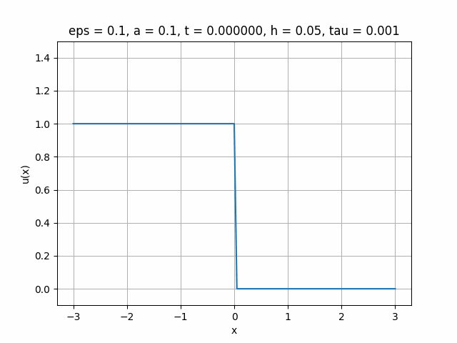

## Аналитическое решение

### Задание

### Решение

Вывод аналитического решении: [открыть решение в pdf](task1/solution.pdf)

Код для визуализации: [Смотреть код](task1/solution.ipynb)

Визуализация:

## Численное решение

### Задание

### Решение

Вывод расчетной формулы для явного метода:

Код численного решения: [смотреть код](task2/solution.ipynb)

Визуализация:

